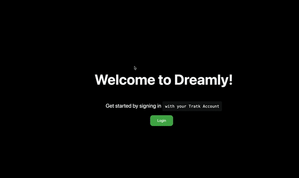

# TraktSimilarity

TraktSimilarity is a Go application that uses the Trakt.tv API to calculate the similarity between the watchlists of two
users.
It is a REST application that takes two users and returns a similarity score between 0 and 1.

This application was created as an exercise to experiment with Github Copilot and ChatGPT.
Most of the code was written by the AI, most of the effort made by me was finding ways to ask properly what I wanted,
and fixing the code to make it work. There is much room for improvement, but the intention wasn't to start a new
business
but to learn and have fun and I did 😁.

Disclaimer: I'm not good with frontend and JS, so the frontend is not the best, but it works (at least the happy path).

## Requirements

* Go 1.19+
* Node 14+

## Installation

1. Clone the repository
2. Update stg_settings.yml with your Trakt API key
3. Create a .env.local inside `frontend` folder with the following content:
```env
TRAKT_CLIENT_ID=[YOUR_CLIENT_ID]
TRAKT_CLIENT_SECRET=[YOUR_CLIENT_SECRET]
AUTH_SECRET=YourSecret
NEXTAUTH_URL=http://localhost:3000
```
4. Run `make run` to start the server, it will be available at `http://localhost:8080`
5. Enter `frontend` directory and run `npm install` to install the frontend dependencies
6. Run `npm run dev` to start the frontend
7. Open `http://localhost:3000` in your browser
8. Play around!

## Usage



### Endpoints

All endpoints require a valid Trakt access token to be passed in the `Authorization` header.

`GET /trakt/watchlist`: Returns the watchlist for a given user

```js
const res = await fetch("http://localhost:8080/trakt/watchlist", {
    headers: {
        Authorization: `Bearer ${accessToken}`,
        "Content-Type": "application/json",
    },
});
```

`GET /trakt/similarity`: Returns the similarity score between the owner of the access token and another user

```js
const res = await fetch("http://localhost:8080/trakt/similarity", {
    headers: {
        Authorization: `Bearer ${accessToken}`,
        "Content-Type": "application/json",
    },
    body: JSON.stringify({
        other_username: username, // username of the other user to compare
    }),
});
```

### Error Handling

If an error occurs, the server will respond with a JSON object containing an error message and an HTTP status code
indicating the type of error.
